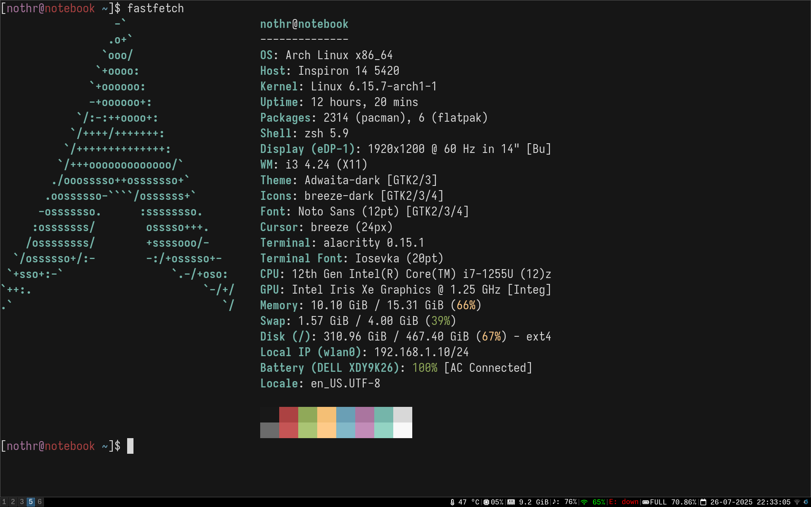

I have't realized that it's been two good years of using linux as full fledged OS.
I have distro-hopped between Arch, Debian and Fedora, but Arch feel like home.
To be honest I hate redhat products(I don't exactly know why) and Debian is the good old distro which is stuck in 2022 or 2023.
And Arch is blazingly fast and I like its package manager which is too good and thanks to [albony mirror](https://mirror.albony.in) for hyd node.

## The Arch Experince

Arch has been my daily driver since the last two years. I have been using `i3` because I don't need to touch the mouse again. I have switched to `KDE` for a while but now I am daily driving `i3`. And I have been using  `alacritty` with `zsh` but now moving to `fish`. 

I have also been using `zed` for a really long time as my editor which performs better than VS Code. There are so many programs that are really good and help me a lot.

I have also started using `typst` as well for reports and assignments. Even though I love latex typst seems really compromising. But I am still experimenting with it.

Now that it's been two years, I might make my homeserver reliable. Currently I host `n8n`, `komodo`, `gitea(the good old)` and `ente`. I might change my private VPS provider to hetzner soon.

I guess arch will be my forever distro. But I am still exploring the arch as a whole distro. I might start exploring the different kernel variants of Arch.

The only issue I currently face is my laptop doesn't support `S3` sleeping state. I might start hacking into the issue to support S3. So one on the internet suggested
that we need to make changes to the `dsdt` but I should research more about it.